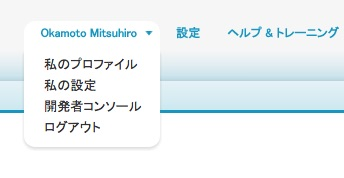

Lightning アプリケーションではデータの取り扱いも簡単に行えます。このモジュールでは、Lightningアプリケーションが取引先責任者を一覧取得や名前やIDを使って検索を行えるApexコントローラの作成を行います。

## 何を学ぶことができるか
- Apexコントローラを作成し、データ及びロジックをクライアントアプリケーションへ提供する


## ステップ

1. Salesforce内にて、画面右上隅の名前をクリックします。ドロップダウンメニューより **開発者コンソール** をクリックします。

    

1. 開発者コンソール内にて **File** > **New** > **Apex Class**　をクリックします。　**ContactListController** をクラス名に入力し、 **OK** をクリックします。

2. 以下のようにクラスを実装します:

    ```java
    public with sharing class ContactListController {

        @AuraEnabled
        public static List<Contact> findAll() {
            return [SELECT id, name, phone FROM Contact LIMIT 50];
        }

        @AuraEnabled
        public static List<Contact> findByName(String searchKey) {
            String name = '%' + searchKey + '%';
            return [SELECT id, name, phone FROM Contact WHERE name LIKE :name LIMIT 50];
        }

        @AuraEnabled
        public static Contact findById(String contactId) {
            return [SELECT id, name, title, phone, mobilephone, Account.Name
                        FROM Contact WHERE Id = :contactId];
        }


    }
    ```


    ### コードハイライト:
    - **ContactListController** は通常のコントローラクラスで、取引先責任者をリストで取得するメソッド　(findAll)や、名前で検索 (findByName) 、Idで検索 (findById)　などのメソッドを持っています。
    - **@AuraEnabled** メソッドアノテーションはメソッドがLightningアプリケーションから呼び出せることを示します。

1. **File** > **Save** をクリックしファイルを保存します。


<div class="row" style="margin-top:40px;">
<div class="col-sm-12">
<a href="setup-environment.html" class="btn btn-default"><i class="glyphicon glyphicon-chevron-left"></i> 戻る</a>
<a href="create-lightning-application.html" class="btn btn-default pull-right">次へ <i class="glyphicon glyphicon-chevron-right"></i></a>
</div>
</div>
