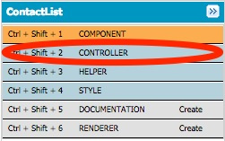
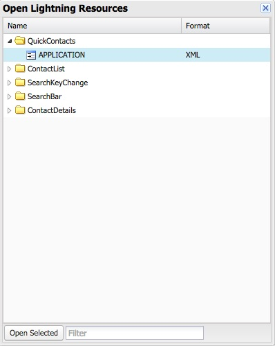
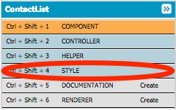

In this module, you create a Lightning Component responsible for displaying the list of contacts and you add that component to the QuickContacts application.

## What you will learn
- Create a Lightning Component in the Developer Console
- Use component attributes
- Use event handlers
- Use Lightning Components in a Lightning Application


## Step 1: Create the Component

1. In the Developer Console, click **File** > **New** > **Lightning Component**. Specify **ContactList** as the bundle name and click **Submit**

2. Implement the component as follows:

    ```
    <aura:component controller="yournamespace.ContactController">

        <aura:attribute name="contacts" type="Contact[]"/>
        <aura:handler name="init" value="{!this}" action="{!c.doInit}" />

        <ul class="list-group">
            <aura:iteration items="{!v.contacts}" var="contact">
                <li class="list-group-item">
                    <a href="{! '#contact/' + contact.Id }">
                        <p>{!contact.Name}</p>
                        <p>{!contact.Phone}</p>
                    </a>
                </li>
            </aura:iteration>
        </ul>

    </aura:component>
    ```

    > Make sure you prefix the controller name with **your own namespace** you created in module 2.

    ### Code Highlights:
    - The controller assigned to the component (first line of code) refers to the **server-side controller** (ContactController) you created in module 3.
    - The **contacts** attribute is defined to hold the list of Contact objects returned from the server.
    - The **init** handler is defined to execute some code when the component is initialized. That code (**doInit**) is defined in the component's
**client-side controller** (you'll implement the controller in the next step).
    - ```<aura:iteration>``` is used to iterate through the list of contacts and create an ```<li>``` for each contact
    - The ```<a href="{! '#contact/' + contact.Id }">``` anchor tag around the contact data is defined to set the page hashtag to **#contact/** followed by the contact id. In module 7, the ContactDetails component will use that hashtag to display details information every time the user clicks a new contact.


1. Click **File** > **Save** to save the file.


## Step 2: Implement the Controller

1. Click **CONTROLLER**

    

1. Implement the Controller as follows:

    ```
    ({
        doInit : function(component, event) {
            var action = component.get("c.findAll");
            action.setCallback(this, function(a) {
                component.set("v.contacts", a.getReturnValue());
            });
            $A.enqueueAction(action);
        }
    })
    ```

    ### Code Highlights:
    - The controller has a single function called **doInit**. This is the function the component calls when it is initialized.
    - You first get a reference to the **findAll()** method in the component's server-side controller (ContactController), and store it in the **action** variable.
    - Since the call to the server's findAll() method is asynchronous, you then register a callback function that is executed when the call returns. In the callback function, you simply assign the list of contacts to the component's **contacts** attribute.
    - $A.enqueueAction(action) sends the request the server. More precisely, it adds the call to the queue of asynchronous server calls. That queue is an optimization feature of Lightning.

1. Click **File** > **Save** to save the file


## Step 3: Add ContactList to the Application UI

1. In the developer console, go back to the **QuickContacts** application.

    If you don't see the tab in the developer console, select **File** > **Open Lightning Resources** in the Developer Console menu, select **QuickContacts** > **APPLICATION** in the dialog, and click the **Open Selected** button.

    


1. Modify the **container** div as follows to add the ContactList component to the application layout.

    ```
    <div class="container">
        <div class="row">
            <div class="col-sm-12">
                <yournamespace:ContactList/>
            </div>
        </div>
    </div>
    ```

    > Make sure you prefix ContactList with **your own namespace** you created in module 2.


1. Click **File** > **Save** to save the file

1. Click **Preview** or **Update Preview**

    

1. Preview the application in your browser

    


## Step 4: Style the Component

There is probably too much space above and below the phone number. In this step, you'll add a style to the component to remove the extra space.


1. Click **STYLE**

    

1. Implement the following style:

    ```
    .THIS p {
        margin: 0;
    }
    ```

1. Click **File** > **Save** to save the file

1. In the developer console, go back to the **QuickContacts** application, click **Preview** or **Update Preview** to preview the application in your browser

    


<div class="row" style="margin-top:40px;">
<div class="col-sm-12">
<a href="create-lightning-application.html" class="btn btn-default"><i class="glyphicon glyphicon-chevron-left"></i> Previous</a>
<a href="create-searchbar-component.html" class="btn btn-default pull-right">Next <i class="glyphicon glyphicon-chevron-right"></i></a>
</div>
</div>
