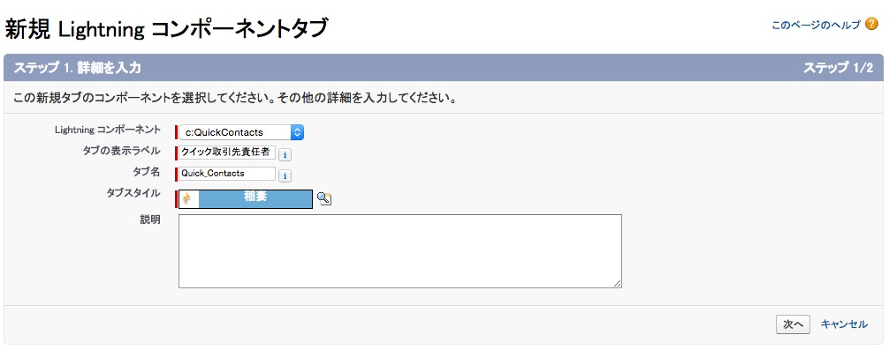
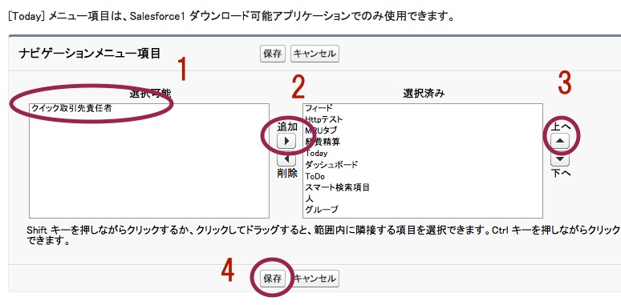
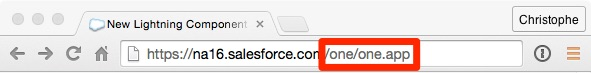
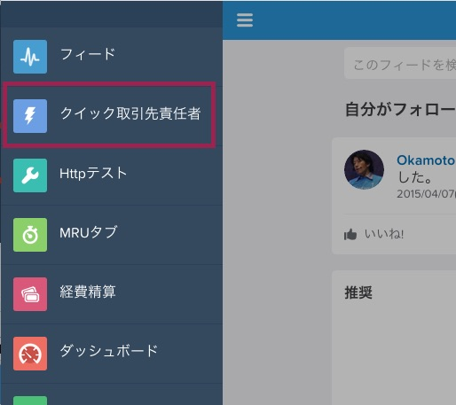
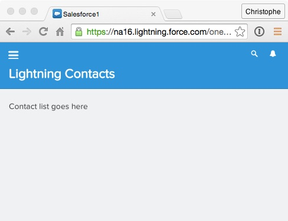

このモジュールでは, QuickContacts Lightning コンポーネントを作成します

## 何を学ぶことができるか
- 開発者コンソール内でのLightning コンポーネント作成方法
- Salesforce1アプリケーション内でのLightning コンポーネントの確認方法


## ステップ 1: コンポーネントの作成

1. 開発者コンソールにて **File** > **New** > **Lightning Component** をクリックし、 **QuickContacts** をバンドル名に入力し、 **Submit** をクリックします。

2. コンポーネントは以下の様に実装します:

    ```
    <aura:component implements="force:appHostable">

        <p>ContactList goes here</p>

    </aura:component>
    ```

    ### コードハイライト:
    - コンポーネントはSalesforce1アプリケーションで実行可能なことを示すために **force:appHostable** インタフェースに対して実装されています。
    - Lightning コンポーネントは他のLightningコンポーネントや、通常のHTMLマークアップを含むことが可能です。

1. **File** > **Save** をクリックし変更を保存します。


## ステップ 2: タブの作成

1. 設定画面より **作成** > **タブ** をクリックします

1. **Lightning コンポーネントタブ** セクションより **新規** をクリックします

    
    - **c:QuickContacts** をLightning コンポーネントに選択します
    - タブの表示ラベルには**クイック取引先責任者** を設定し **Quick_Contacts** をタブ名に設定します。
    - 虫眼鏡アイコンをクリックし **稲妻** をタブアイコンに設定します

1. **次へ** 及び **保存** をクリックします。


## ステップ 3: モバイルナビゲーションへタブを追加

1. このステップでは **管理** > **モバイル管理** > **モバイルナビゲーション** を設定します

    
    - **クイック取引先責任者** を **選択可能** のリストから選択します
    - **追加** をクリックします
    - **選択済み** リストの中から **クイック取引先責任者** を選択し、 **上へ** ボタンをクリックして、メニュー内の順序を上位へ変更します。
    - **保存** をクリックします。


## ステップ 4: Salesforce1アプリケーションでコンポーネントをプレビューする

1. Salesforceへアクセス以下のようにURLを変更します:

    
    - URLからsalesforce.com以降の部分をすべて削除します
    - /one/one.app to をsalesforce.com以降のURLとして追加します

    > Salesforce1アプリケーションシュミレータが起動します

1. 左上隅のメニューボタンをクリックします

1. メニュー内の**クイック取引先責任者** をクリックします

    

1. コンポーネントを確認します

    

<div class="row" style="margin-top:40px;">
<div class="col-sm-12">
<a href="create-apex-controller.html" class="btn btn-default"><i class="glyphicon glyphicon-chevron-left"></i> 戻る</a>
<a href="create-contactlist-component.html" class="btn btn-default pull-right">次へ <i class="glyphicon glyphicon-chevron-right"></i></a>
</div>
</div>
