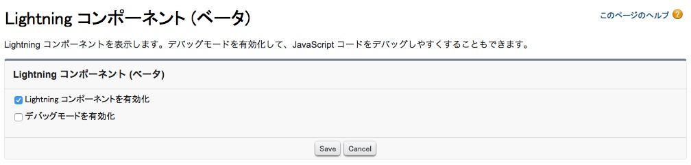

In this module, you set up your environment to enable Lightning development.

## What you will learn
- Create a Namespace
- Enable Lightning Components in your Salesforce org
- Upload Static Resources for use in your Lightning application

## Step 1: Create a Namespace

A namespace is globally unique across all Salesforce organizations. Namespaces are case-insensitive and have a maximum length of 15 alphanumerical characters.

1. Login to your Salesforce Developer Edition

1. Click **Setup** (upper right corner)

1. Click **Create** > **Packages** (left navigation)

1. Click **Edit** and **Continue**

1. Enter the namespace prefix you want to register, and click **Check Availability**. If the namespace you entered is not available, try again until you find a namespace that is available.

1. Click **Review My Selections**

1. Click **Save**

## Step 2: Enable Lightning Components

1. In Setup, click **Develop** > **Lightning Components**

1. Check the **Enable Lightning Components** checkbox

    

1. Click **Save**

## Step 3: Upload Bootstrap as a Static Resource

To help you make the application look good, you will use a version of Twitter Bootstrap customized to match the [Salesforce1 guideline](http://sfdc-styleguide.herokuapp.com/).

1. Download and unzip the Salesforce Foundation Bootstrap [here](http://developer.salesforcefoundation.org/bootstrap-sf1/)

1. In Salesforce, click **Setup** > **Build** > **Develop** > **Static Resources**

1. Click **New**
 
1. Specify **bootstrap** as the **Name**, then click the **Choose File** button, and select the **bootstrap.css** in the **dist/css** directory of the unzipped bootstrap folder

    

1. Click **Save**

<a href="create-developer-edition.html" class="btn btn-default"><i class="glyphicon glyphicon-chevron-left"></i> Previous</a>
<a href="create-apex-controller.html" class="btn btn-default pull-right">Next <i class="glyphicon glyphicon-chevron-right"></i></a>

